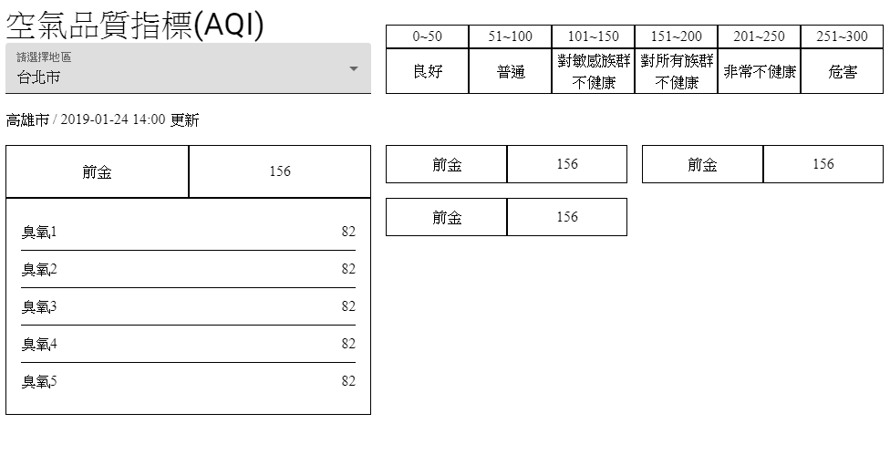
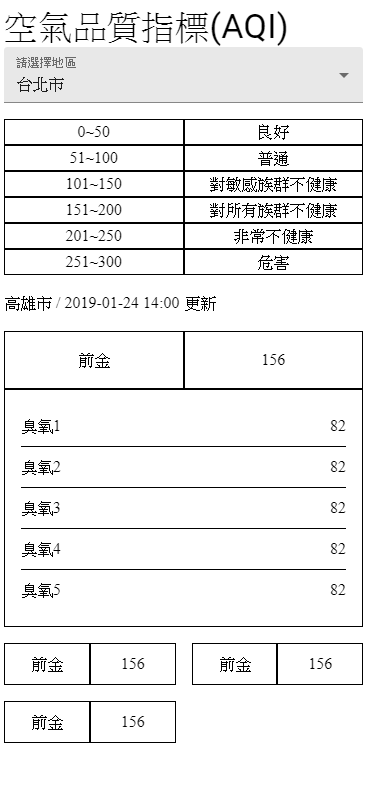
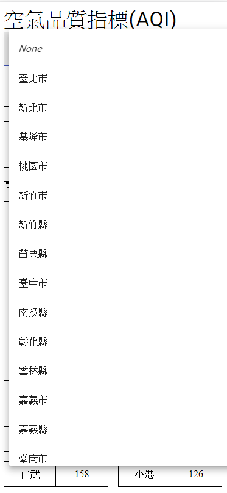

# 5F — 全台空氣指標儀表板

## 使用技術
- react
- typeScript
- material ui
<p>先將版型區分好，切好版</p>

<p>RWD</p>


### 引入自訂義的主題色

```
import { ThemeProvider, createMuiTheme } from '@material-ui/core/styles';
```
<p>在要傳遞顏色的父層組件用ThemeProvider包在最外層</p>
<p>並使用createMuiTheme定義需要的自訂顏色</p>

```js
// TS定義型別
declare module '@material-ui/core/styles/createMuiTheme' {
  interface Theme {
    custom: {
      green: string,
      yellow: string,
      orange: string,
      red: string,
      blue: string,
      purple: string,
    };
  }

  interface ThemeOptions {
    custom?: {
      green?: string,
      yellow?: string,
      orange?: string,
      red?: string,
      blue?: string,
      purple?: string,
    };
  }
}

const theme = createMuiTheme({
  custom: {
    green: 'green',
    yellow: 'yellow',
    orange: 'orange',
    red: 'red',
    blue: 'blue',
    purple: 'purple',
  }
});

ReactDOM.render(
  <ThemeProvider theme={theme}>
    <App />
  </ThemeProvider>
  ,
  document.getElementById('root')
);
```
<p>這樣App以下的元件皆可以用theme.custom定義的顏色</p>

```js
// EX:
mainBg: {
    background: theme.custom.green
}
```

### 獲取API資料，將API統一管理
- 新增一個資料夾專門管理API檔案 (common/api.tsx)
- 使用axios.create定義baseURL(網址)，這樣的好處是之後如果API需要更改可以直接改baseURL

```js
import axios from 'axios'

const airOpendata = axios.create({
    baseURL: 'https://data.epa.gov.tw',
})
// 取得各地數據 API
export const getAirData = (data = {}) => airOpendata.get('/api/v1/aqx_p_432?limit=1000&api_key=9be7b239-557b-4c10-9775-78cadfc555e9&format=json', data)
```

- 在需要資料的原件用then接收response資料
```js
useEffect( () => {
    console.log('useEffect')
    getAirData()
    .then(res => {
        if(res.status === 200){
        setCityList(res.data.records)
        }
    })
    .catch(rej => console.log(rej))
},[])
```
- 過濾父組件(App)傳遞下來的資料
```js
// 定義props(TS)
interface IProps {
    // 表示cityList陣列裡面有數個{ICitylist}的定義
    cityList: ICitylist[]
}
```

```js
// 先用map取得需要的城市名稱
const cityName = props.cityList.map((item: ICitylist, index, arr) => {
    return item.County
})
// 在此用filter過濾重複值
const filterCityName = cityName.filter((item, index, arr) => {
    return arr.indexOf(item) === index
})
```
